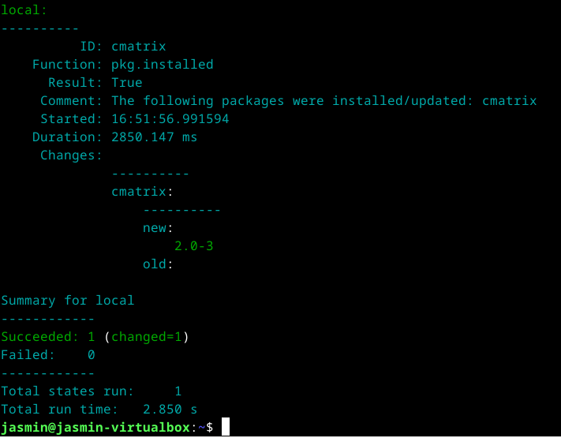
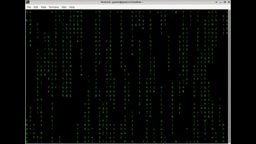
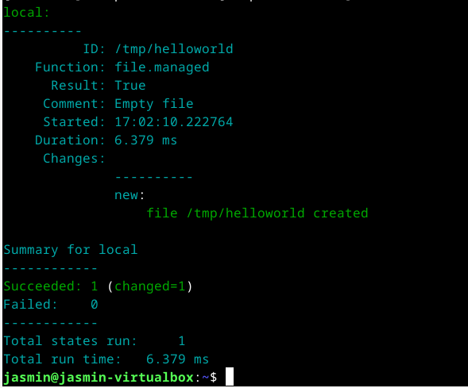
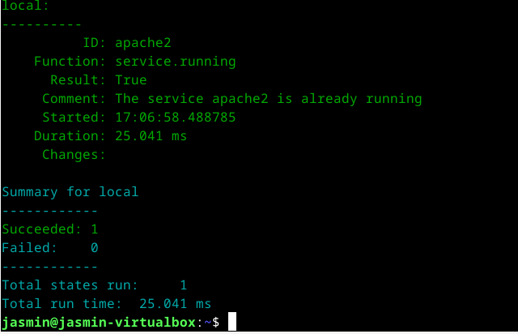
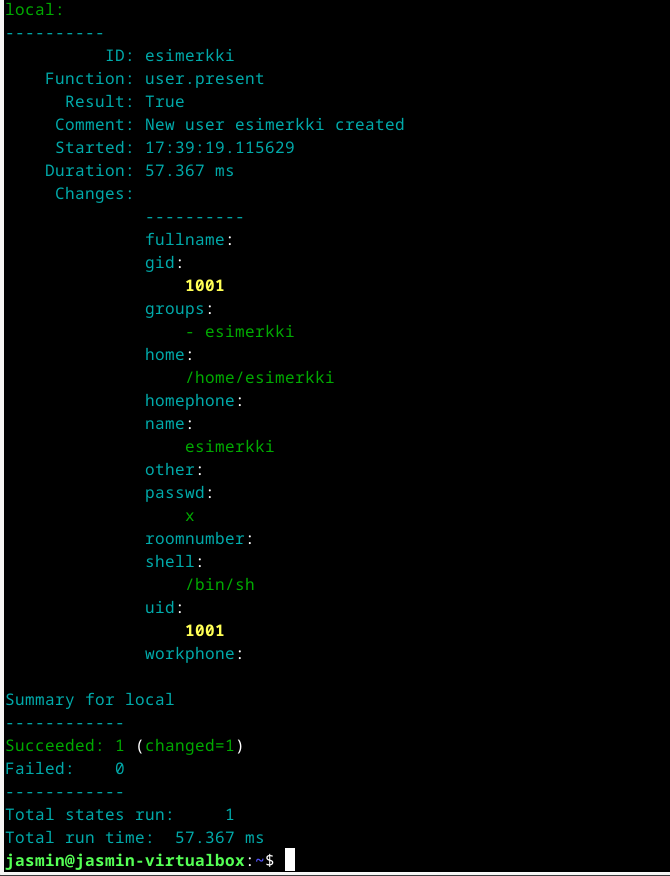
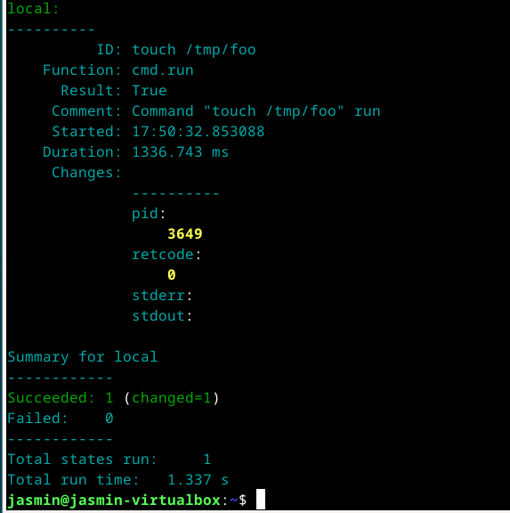
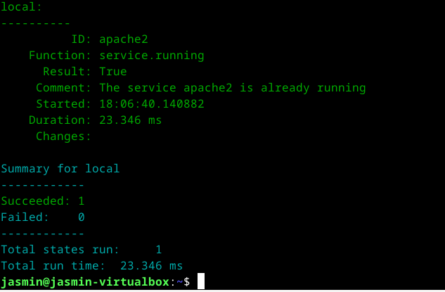
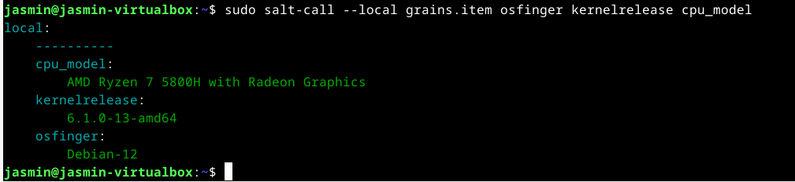

## x)
Create webpage using github
- Github sivun luominen on nopeaa.
- Rekisteröidy githubiin
- Luo uusi repository ja siihen readme.md -tiedosto
- Luo .md -tiedosto, johon voi lisätä tekstiä
- "Commit"
  
(Karvinen, 2023a)

Run Salt Command Locally
- Salt komentojen ajaminen paikallisesti on hyödyllistä harjoittelemiseen ja testaukseen.
- Tärkeimmät funktiot:
	- pkg
	- file
	- user
	- cmd
   
(Karvinen, 2021)
## a) 

Asensin tehtäviä varten puhtaan Debian 12 virtuaalikoneen. Koneeseen määritetty 4 ydintä, 4096mb ramia.

Asensin saltin [tehtävänanto sivulta löytyvän](https://terokarvinen.com/2023/configuration-management-2023-autumn/#:~:text=Saltin%20asennus%20Debian%2012.%20T%C3%A4ss%C3%A4%20siis%20kukin%20rivi%20alkaa%20promptin%20merkill%C3%A4%20%22%24%22%20ja%20rullautuu%20t%C3%A4ss%C3%A4%20sivulla.) (Karvinen, 2023b) ohjeen mukaan. 
```bash
sudo mkdir /etc/apt/keyrings
sudo curl -fsSL -o /etc/apt/keyrings/salt-archive-keyring-2023.gpg https://repo.saltproject.io/salt/py3/debian/11/amd64/SALT-PROJECT-GPG-PUBKEY-2023.gpg
echo "deb [signed-by=/etc/apt/keyrings/salt-archive-keyring-2023.gpg arch=amd64] https://repo.saltproject.io/salt/py3/debian/11/amd64/latest bullseye main" | sudo tee /etc/apt/sources.list.d/salt.list
sudo apt-get update
sudo apt-get install salt-minion
```
Ensimmäinen komento luo kansion `/etc/apt/keyrings`.

Toinen komento lataa SALT-PROJECT-GPG-PUBKEY-2023.gpg -nimisen GPG-avaimen osoitteesta https://repo.saltproject.io/salt/py3/debian/11/amd64/SALT-PROJECT-GPG-PUBKEY-2023.gpg ja tallentaa sen /etc/apt/keyrings/salt-archive-keyring-2023.gpg -nimellä.

Kolmas komento lisää uuden apt-pakettilähteen tiedoston nimeltä `salt.list`, `/etc/apt/sources.list.d/` -hakemistoon. Lähde osoittaa Saltin viralliseen pakettivarastoon ja käyttää aiemmin ladattua GPG-avainta (salt-archive-keyring-2023.gpg) allekirjoituksen tarkistamiseen.

Neljäs komento päivittää paketit.

Viides komento lataa salt-minionin.

Tälläistä asennustapaa käytettiin, koska ohjelmisto ei ole saatavilla virallisissa Debianin pakettilähteissä. 

## b) 
### pkg
Ajoin komennon `sudo salt-call --local -l info state.single pkg.installed cmatrix`, joka määrittää, että cmatrix on asennettuna. 
Komennossa `sudo` käynnistää komennon pääkäyttäjän oikeuksilla.
`salt-call` ajaa moduleita minionilla paikallisesti.

>The  salt-call  command is used to run module functions locally on a minion instead of executing them from the master. Salt-call is used to run  a  Standalone  Minion,  and  was  originally  created  for troubleshooting.
> - salt-call man page

`--local` määrittää, että komento suoritetaan paikallisesti.
>Run salt-call locally, as if there was no master running.
>- salt-call man page

`-l info` asettaa lokitason info tasolle.
`state.single` [ajaa yhden tilafunktion.](https://docs.saltproject.io/en/latest/ref/modules/all/salt.modules.state.html#salt.modules.state.single)
`pkg.installed` [moduuli, joka hallitsee ohjelmisto paketteja.](https://docs.saltproject.io/en/latest/ref/states/all/salt.states.pkg.html)
`cmatrix` on määrittetty asennettava paketti. 



`ID: cmatrix` tapahtuman kohde.

`Function` kertoo mikä komento ajettiin.

`Result: True` tapahtuma on todellinen.

`Comment: ` Kertoo mitkä paketit asennettiin.

`Started: ` Kertoo aloitusajan.

`Duration: ` Kertoo kauan kesti.

`Changes: ` Kertoo mikä muuttui ja mikä on uutta, tässä tapauksessa uutena tuli cmatrixin 2.0-3.

`Succeeded: 1 (changed=1)` Kertoo, että suoritus onnistui.

`Total states run: 1` Kertoo monesti ajettiin. 



### file

Ajoin komennon `sudo salt-call --local -l info state.single file.managed /tmp/helloworld`, joka laittoi tmp -kansioon helloworld tiedoston. 
tmp -kansiosta poistuu kaikki tiedostot, kun kone sammutetaan. 



### service
Tätä varten asensin apachen `sudo apt-get -y apache2` -komennolla, jotta voin demonstroida service.running -komentoa.

`sudo salt-call --local -l info state.single service.running apache2 enable=True`
Komento varmistaa, että palvelu on käynnissä.



### user
Ajoin komennon `sudo salt-call --local -l info state.single user.present esimerkki`. [Komento määrittää, että käyttäjä on läsnä järjestelmässä.](https://docs.saltproject.io/en/latest/ref/states/all/salt.states.user.html) Komento loi käyttäjän esimerkki ja asetti sille kotihakemiston `home/esimerkki`. 



### cmd.run
Ajoin komennon `sudo salt-call --local -l info state.single cmd.run 'touch /tmp/foo' creates="/tmp/foo"`.  
[cmd.run ajaa komennon määritetyillä ehdoilla.](https://docs.saltproject.io/en/latest/ref/states/all/salt.states.cmd.html)
`creates="/tmp/foo"` ajetaan ainoastaan jos `/tmp/foo` ei ole olemassa. 



## c)
Ajoin komennon `sudo salt-call --local -l info state.single service.running apache2 enable=True` uudelleen. 



Idempotenssin mukaisesti, kun tila vastaa halutun tilan kanssa, komennon uudelleen ajaminen ei muuta mitään, koska tila on jo saavutettu.  

##  d)
Ajoin komennon `sudo salt-call --local grains.item osfinger kernelrelease cpu_model`, joka hakee komennossa määritettyjä tietoja.



`cpu_model` kertoo käytössä olevan prosessori mallin.

`kernelrelease` kertoo kerneli version.

`osfinger` kertoo käyttöjärjestelmän nimen ja version. 


## Lähteet

Karvinen, T. 2023a. Create a Web Page Using Github. Luettavissa: https://terokarvinen.com/2023/create-a-web-page-using-github/

Karvinen, T. 2023b. https://terokarvinen.com/2023/configuration-management-2023-autumn/

Karvinen, T. 2021. Run Salt Command Locally. Luettavissa: https://terokarvinen.com/2021/salt-run-command-locally/

Salt Project. 2023a. SALT.STATES.PKG. Luettavissa: https://docs.saltproject.io/en/latest/ref/states/all/salt.states.pkg.html

Salt Project. 2023b. salt modules state single. Luettavissa: https://docs.saltproject.io/en/latest/ref/modules/all/salt.modules.state.html#salt.modules.state.single

Salt Project. 2023c. Luettavissa:  https://docs.saltproject.io/en/latest/ref/states/all/salt.states.user.html

Salt Project. 2023d. Luettavissa: https://docs.saltproject.io/en/latest/ref/states/all/salt.states.cmd.html
