## x)
### [What is the definition of "cattle not pets"?](https://devops.stackexchange.com/questions/653/what-is-the-definition-of-cattle-not-pets#654)
- "cattle not pets" sanontaa käytetään kuvaamaan kahta erilaista lähestymistapaa palvelimien hallintaan.
- "Lemmikit" ovat korvaamattomia, manuaalisesti hallittuja palvelimia, kun taas "Karja" viittaa automatisoituihin, vikoihin varautuneisiin palvelinryhmiin.
- Käsitteen keskeinen ajatus on siirtyminen palvelinten kohtelusta ainutlaatuisina ja tunnesiteitä herättävinä ("Lemmikit") helposti korvattaviksi yksiköiksi ("Karja").

### [Vagrant Revisited – Install & Boot New Virtual Machine in 31 seconds](https://terokarvinen.com/2017/04/11/vagrant-revisited-install-boot-new-virtual-machine-in-31-seconds/)
- Vagrantilla uuden virtuaali koneen asennus on nopeaa.
- Asenna Vagrant ja VirtualBox, alusta uusi kone, ja kun haluat poistaa sen, käytä 'vagrant destroy'.

### [Salt Vagrant - automatically provision one master and two slaves](https://terokarvinen.com/2023/salt-vagrant/)
- Vagrantin konfiguraatiotiedostoa muokkaamalla saadaan helposti pystytettyä useampi kone hetkessä.
- Koneita voidaan hallita yhdeltä koneelta SaltStackin avulla.

## a) 
Suoritin seuraavat tehtävät Windows 11 -käyttöjärjestelmää käyttävällä koneellani.

Asensin vagrantin sen viralliselta [lataussivulta](https://developer.hashicorp.com/vagrant/downloads).
`vagrant init bento/debian-12` -komennolla latasin debianin.
`vagrant up` -komenolla ajoin koneen päälle.
`vagrant ssh` -komennolla otin yhteyden koneeseen.
`curl terokarvinen.com` -komenolla testasin, että verkkoyhteys toimii.
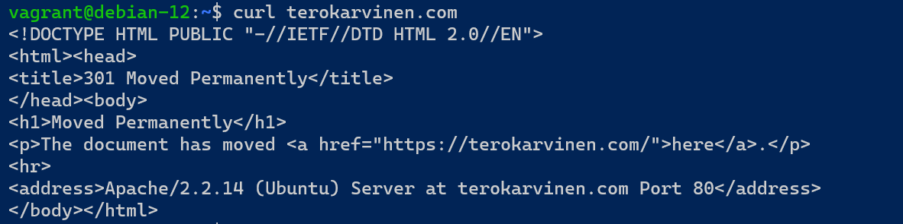

## b) 

SSH -yhteyden yli asensin koneelle saltin seuraavilla komennoilla: 
```bash
sudo mkdir /etc/apt/keyrings
sudo curl -fsSL -o /etc/apt/keyrings/salt-archive-keyring-2023.gpg https://repo.saltproject.io/salt/py3/debian/11/amd64/SALT-PROJECT-GPG-PUBKEY-2023.gpg
echo "deb [signed-by=/etc/apt/keyrings/salt-archive-keyring-2023.gpg arch=amd64] https://repo.saltproject.io/salt/py3/debian/11/amd64/latest bullseye main" | sudo tee /etc/apt/sources.list.d/salt.list
sudo apt-get update
sudo apt-get install salt-minion
sudo apt-get install salt-master
```

## c)
Poistin aiemmin luomani koneen `vagrant destroy -f` -komennolla ja muokkasin Vagrant-konfiguraatiotiedostoa (Vagrantfile) seuraavalla tavalla:
```ruby
Vagrant.configure("2") do |config|
  config.vm.define :master do |master|
    master.vm.box = "bento/debian-12"
    master.vm.network "private_network", ip: "192.168.56.11"
  end

  config.vm.define :minion do |minion|
    minion.vm.box = "bento/debian-12"
    minion.vm.network "private_network", ip: "192.168.56.12"
  end

    config.vm.provider "virtualbox" do |vb|
     vb.memory = "1024"
     vb.cpus = 2
   end
end
```
Nyt vagrant konf.tiedosto mahdollistaa kahden koneen luomisen. Koneille on kummallekkin määritelty oma IP-osoite yksityisessä verkossa.
Testasin `vagrant status` -komennolla, että molemmat koneet olivat päällä. 

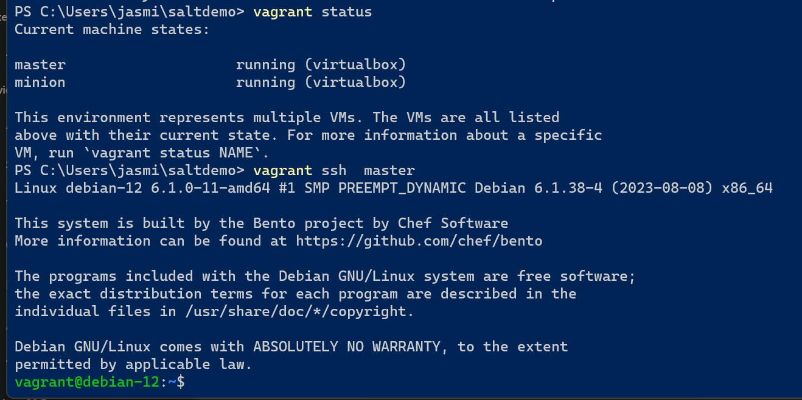

Jatkoin ottamalla SSH-yhteyden 'master'-koneeseen ja onnistuin pingaamaan 'minion'-konetta, mikä osoittaa, että verkkokonfiguraatio toimii onnistuneesti. 

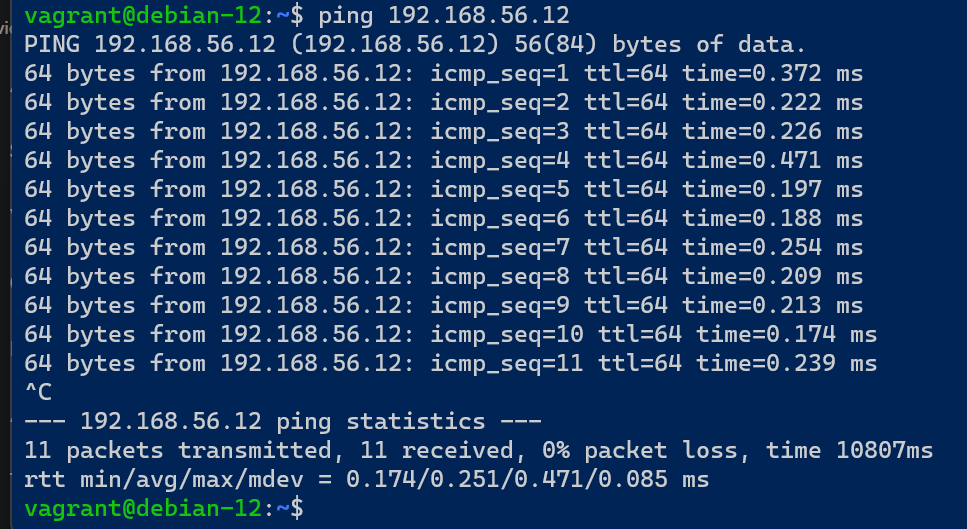

Taas poistin molemmat koneet `vagrant destroy -f` -komennolla ja lisäsin vagrant konfiguraatiotiedostoon myös saltin asennus scriptit. 

```ruby
Vagrant.configure("2") do |config|
  config.vm.define :master do |master|
    master.vm.box = "bento/debian-12"
    master.vm.network "private_network", ip: "192.168.56.11"
    master.vm.provision "shell", inline: <<-SHELL
      echo "Master provisioning script"
      sudo mkdir /etc/apt/keyrings
      sudo curl -fsSL -o /etc/apt/keyrings/salt-archive-keyring-2023.gpg https://repo.saltproject.io/salt/py3/debian/11/amd64/SALT-PROJECT-GPG-PUBKEY-2023.gpg
      echo "deb [signed-by=/etc/apt/keyrings/salt-archive-keyring-2023.gpg arch=amd64] https://repo.saltproject.io/salt/py3/debian/11/amd64/latest bullseye main" | sudo tee /etc/apt/sources.list.d/salt.list
      sudo apt-get update -y
      sudo apt-get install salt-master -y
    SHELL
  end

  config.vm.define :minion do |minion|
    minion.vm.box = "bento/debian-12"
    minion.vm.network "private_network", ip: "192.168.56.12"
    minion.vm.provision "shell", inline: <<-SHELL
      echo "Minion provisioning script"
      sudo mkdir /etc/apt/keyrings
      sudo curl -fsSL -o /etc/apt/keyrings/salt-archive-keyring-2023.gpg https://repo.saltproject.io/salt/py3/debian/11/amd64/SALT-PROJECT-GPG-PUBKEY-2023.gpg
      echo "deb [signed-by=/etc/apt/keyrings/salt-archive-keyring-2023.gpg arch=amd64] https://repo.saltproject.io/salt/py3/debian/11/amd64/latest bullseye main" | sudo tee /etc/apt/sources.list.d/salt.list
      sudo apt-get update -y
      sudo apt-get install salt-minion -y
      echo "master: 192.168.56.11" > /etc/salt/minion
      sudo service salt-minion restart
    SHELL
  end

    config.vm.provider "virtualbox" do |vb|
     vb.memory = "1024"
     vb.cpus = 2
   end
end
```
Katsoin tähän konfiguraatiotiedostoon esimerkkiä [Teron artikkelista](https://terokarvinen.com/2023/salt-vagrant/#:~:text=Vagrantfile%20in%20place.-,Ready%20made%20Vagrantfile%20for%20three%20computers,-%23%20%2D*%2D%20mode%3A%20ruby%20%2D*%2D). 
Provisiointien merkityksestä ja käyttötarkoituksesta löytyi hyvää tietoa [vagrantin dokumentaatiosta](https://developer.hashicorp.com/vagrant/docs/provisioning/basic_usage). 
Esimerkiksi `minion.vm.provision "shell", inline` on osa konfiguraatiota, joka käyttää "shell" -provisiointityyppiä ja suorittaa määritellyn "inline" -skriptin virtuaalikoneen asennusprosessissa, tässä tapauksessa se on määritetty asentamaan saltin ja masterin /minionin.

Ajoin koneet pystyyn `vagrant up` -komennolla ja otin ssh yhteyden masteriin (`vagrant ssh master`), jossa ajoin komennon `sudo salt-key -A`.
Tämä komento hyväksyy 'minionin' lähettämät avaimet ja mahdollisti niiden liittämisen 'masteriin'.

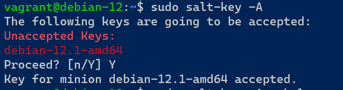

Lopuksi, varmistaakseni, että yhteys 'masterin' ja 'minionin' välillä toimii oikein, suoritin komennon `sudo salt '*' test.ping`, joka testasi, että 'master' ja 'minion' voivat kommunikoida onnistuneesti.

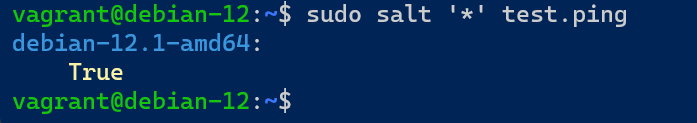

## e)

Ajoin master -koneella `sudo salt '*' state.single file.managed /tmp/helloworld` -komennon. Komento teki tmp -kansioon helloworld tiedoston.

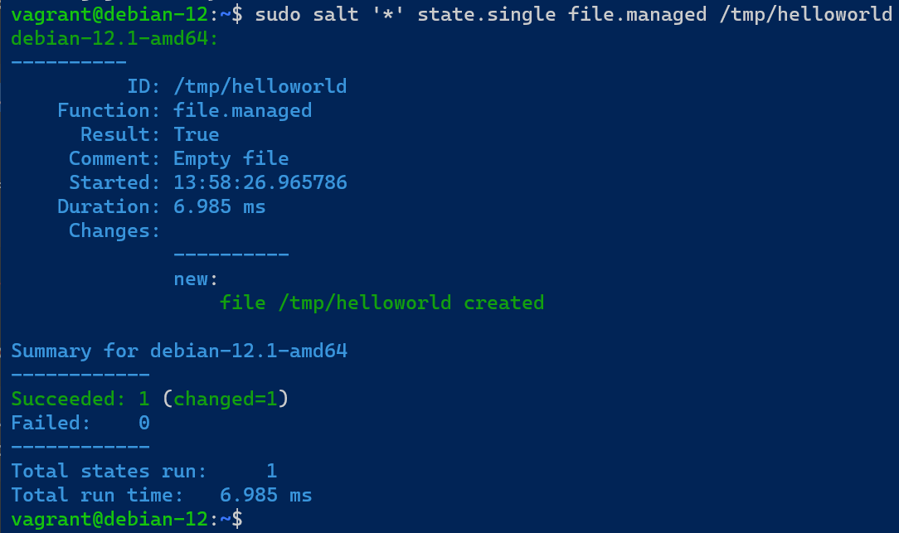

Suoritin vielä saman komennon uudelleen, jotta varmistumme idempotentin toteutumisesta.

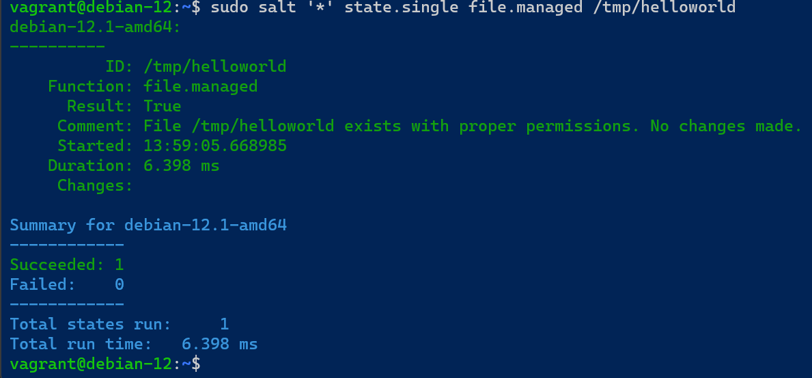


Suoritin komennon `sudo salt '*' state.single pkg.installed apache2`, joka varmistaa, että koneelle on asennettu apache2.

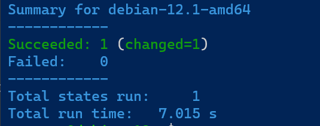

Ajoin saman komennon vielä uudelleen ja muutoksia ei tullut, joten voidaan todeta idempotentin toimivan.

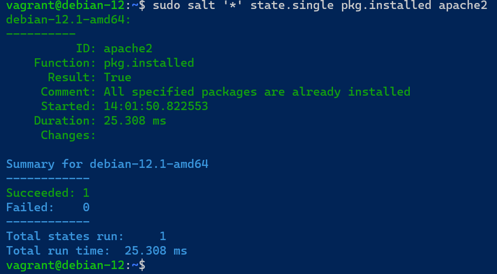

Ajoin komennon `sudo salt '*' state.single service.running apache2` Komento varmistaa, että apache2 on käynnissä järjestelmässä. 

Varmistin vielä Apachen toiminnan tarkistamalla sen tilan komennolla `curl -s 192.168.56.12 | grep title`. Tämä komento haki verkkosivun otsikon ('title') määritetystä IP-osoitteesta.

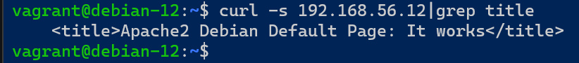

Sammutin apachen `sudo salt '*' state.single service.dead apache2` -komennolla.

## f)
Ajoin komennon `sudo salt '*' grains.item osfinger kernelrelease`, joka palautti käyttöjärjestelmän nimen ja version ja kerneli version.

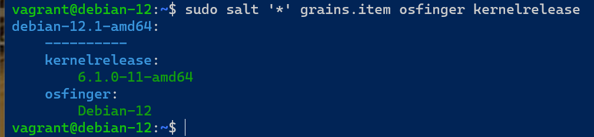

`sudo salt '*' grain.items` -komento palauttaisi enemmän tietoa.

## g)
Ajoin shell komennon orjalla ajamalla `sudo salt '*' cmd.run 'ls -la'`

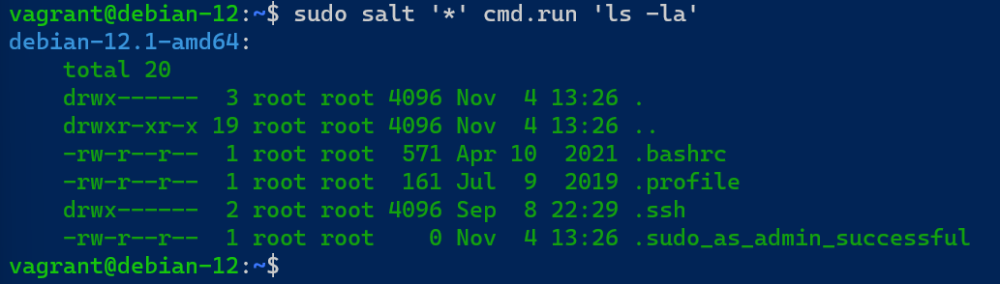

## h)

Ajoin master koneella `sudo mkdir -p /srv/salt/hello` -komennon, joka tekee /srv/salt/hello hakemiston. 
`sudoedit /srv/salt/hello/init.sls` - komennolla muokkasin init.sls tiedostoa.  
```yaml
hello_state:
  pkg.installed:
    - name: cmatrix
```
`hello_state` on tilan(?) nimi. Tähän kohtaan voidaan tietääkseni laittaa mitä tahansa nimeksi.

`pkg.installed` salt moduuli, jolla asennetaan paketti.

`name: cmatrix` on asennettavan paketin nimi.

Ajoin `sudo salt '*' state.apply hello` -komennon, joka pyrkii varmistamaan, että minion -koneella on asennettuna cmatrix.

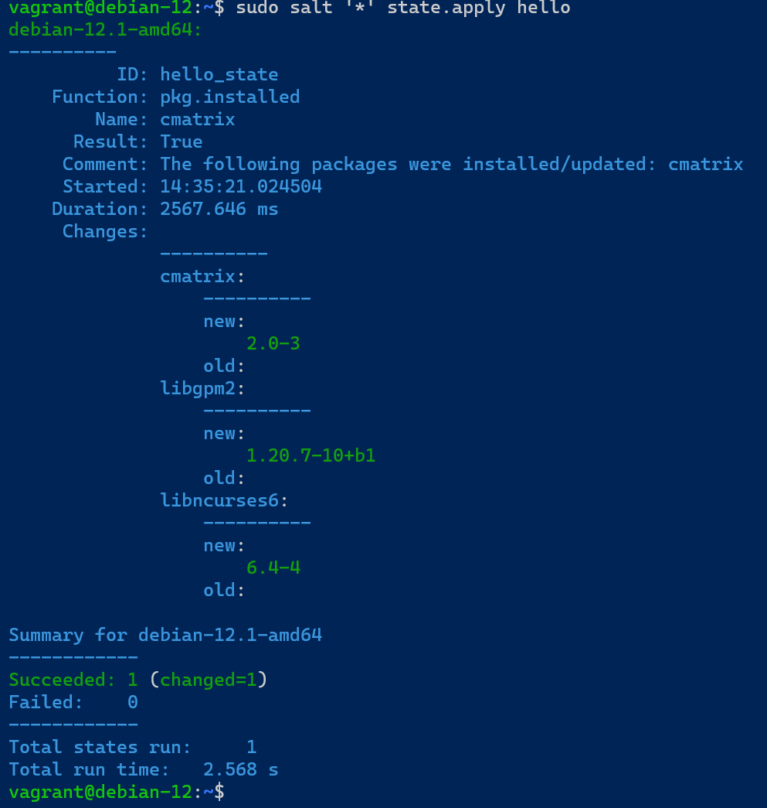

Lopuksi otin ssh-yhteyden minion -koneeseen ja testasin onko cmatrix asennettuna.

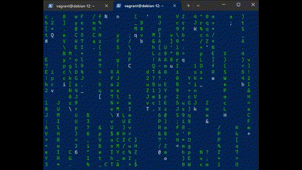

## Lähteet
HashiCorp Developer. 2023. Install Vagrant. Luettavissa: https://developer.hashicorp.com/vagrant/downloads

HashiCorp Developer. 2023. Vagrant Documentation. Luettavissa: https://developer.hashicorp.com/vagrant/docs

Hashicorp Developer. 2023. Basic Usage of Provisioners. Luettavissa: https://developer.hashicorp.com/vagrant/docs/provisioning/basic_usage

Karvinen, T. 2017. Vagrant Revisited – Install & Boot New Virtual Machine in 31 seconds. Luettavissa: https://terokarvinen.com/2017/04/11/vagrant-revisited-install-boot-new-virtual-machine-in-31-seconds/

Karvinen, T. 2023. Salt Vagrant - automatically provision one master and two slaves. Luettavissa: https://terokarvinen.com/2023/salt-vagrant/
