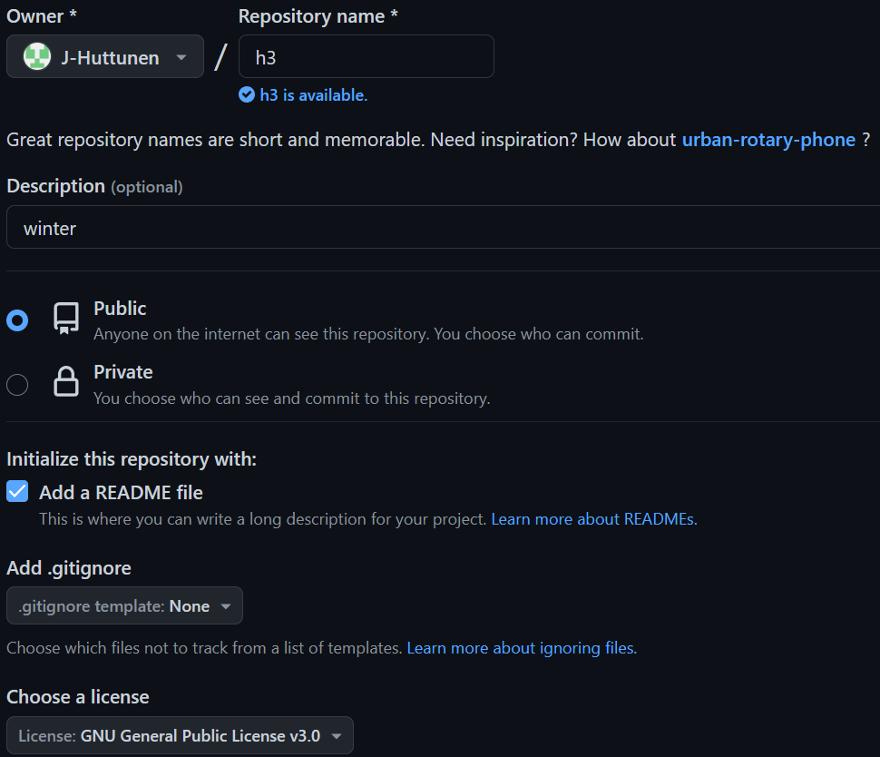
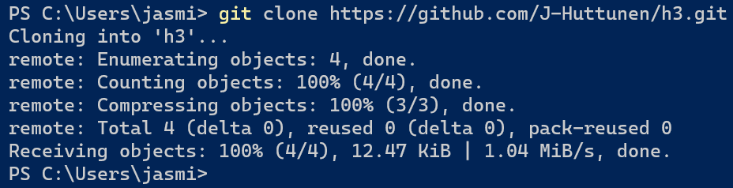
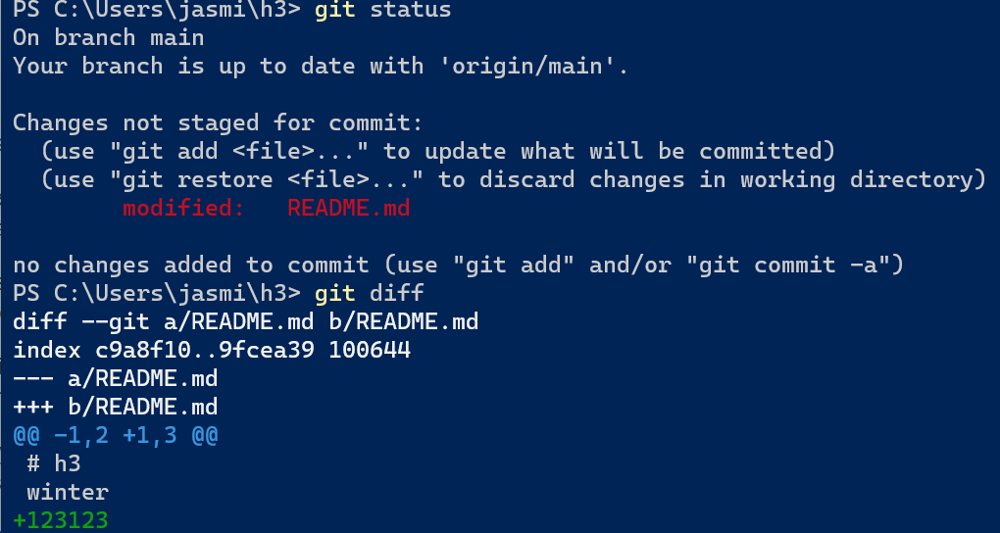
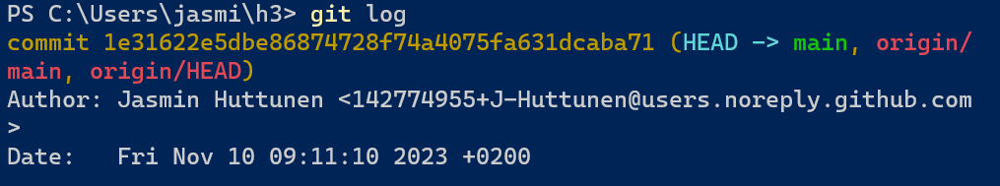
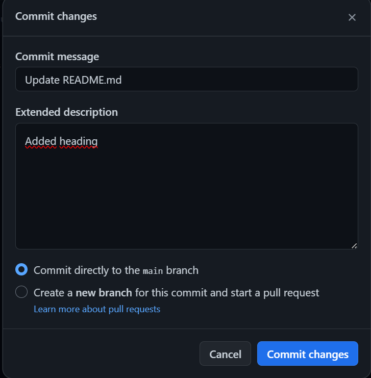
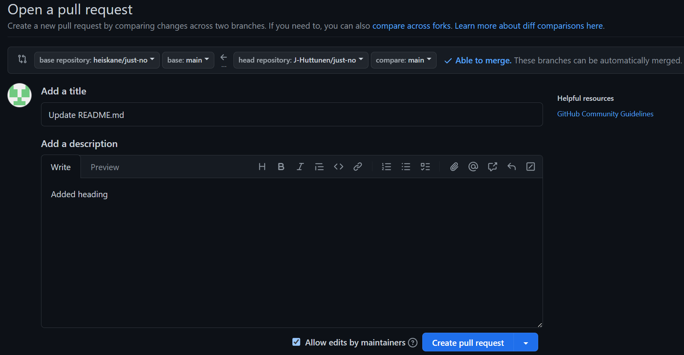

## a)
Tein uuden repositoryn githubiin h3 -nimellä. Määritin sen julkiseksi, lisäsin readme -tiedoston.

## b)
Ajoin powershellissä komennon `git clone https://github.com/J-Huttunen/h3.git`, jolla kopioin uuden repositoryn koneelleni. Repon kloonaus ei vaatinut autentikointia, koska githubissa oli jo ssh-avaimeni.

## c)
Tein h3 -kansioon teksitiedoston foo.txt. En puskenut tätä gittiin missään vaiheessa, joten `git reset --hard` -komento ei tässä tapauksessa toiminut, koska komento palauttaa muutoksia ja uusi tiedosto on lisäys.

Päädyin siis muokkaamaan readme.md tiedostoa, ajoin `git status` ja `git diff`. Ensimmäisestä komennosta näkee gitin tilan ja toisesta tulleet muutokset. Ajoin `git reset --hard` ja muutokset poistuivat.

## d)
Ajoin komennon `git log`, joka palautaa gitin logit.

Commit kohdassa on viimeisimmän commitin tiivisteluku. ([jokainen commit saa uniikin sha1 tarkistesumman](https://git-scm.com/book/en/v2/Git-Basics-Viewing-the-Commit-History).)

Author kohdassa on minun githubiin laittama nimi. En tiedä mistä tuo sähköpostiosoite tulee. Sähköpostia voisin halutessani muokata `git config user.email "esimerkki@esimerkki.com"` -komennolla.

## e)
Menin "forkkaamaan" ystäväni repon. Tämä tarkoittaa sitä, että tein oman kopioni siitä.
Kävin muokkaamassa oman kopioni readme -tiedostoa.

Tämän jälkeen tein "pull requestin", jonka ystäväni kävi hyväksymässä ja tekemäni muutokset tulivat näkyviin hänen repossaan. 

## Lähteet
https://git-scm.com/book/en/v2/Git-Basics-Viewing-the-Commit-History
