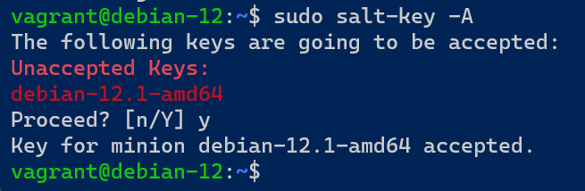
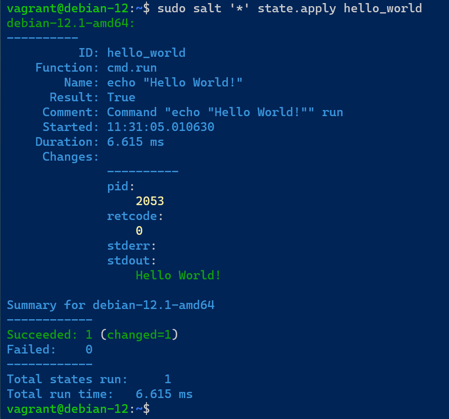
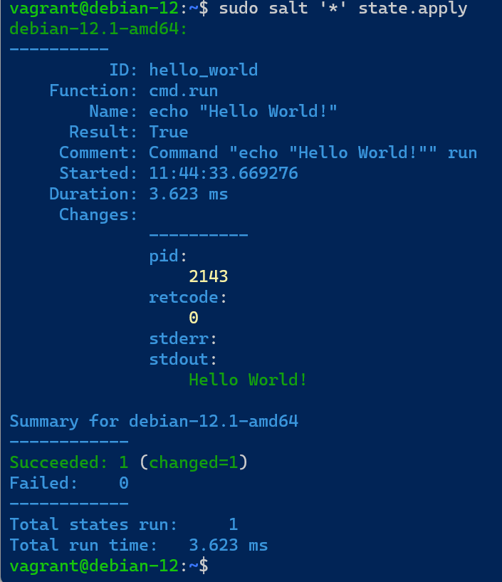
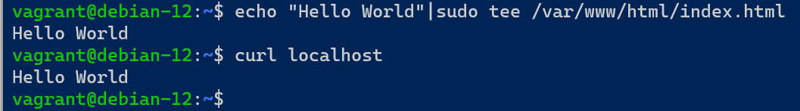
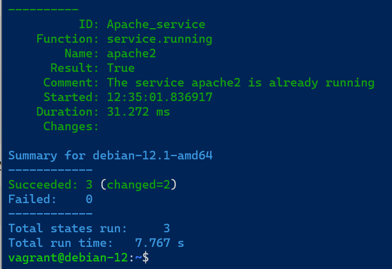
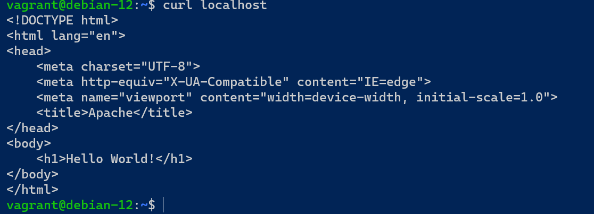
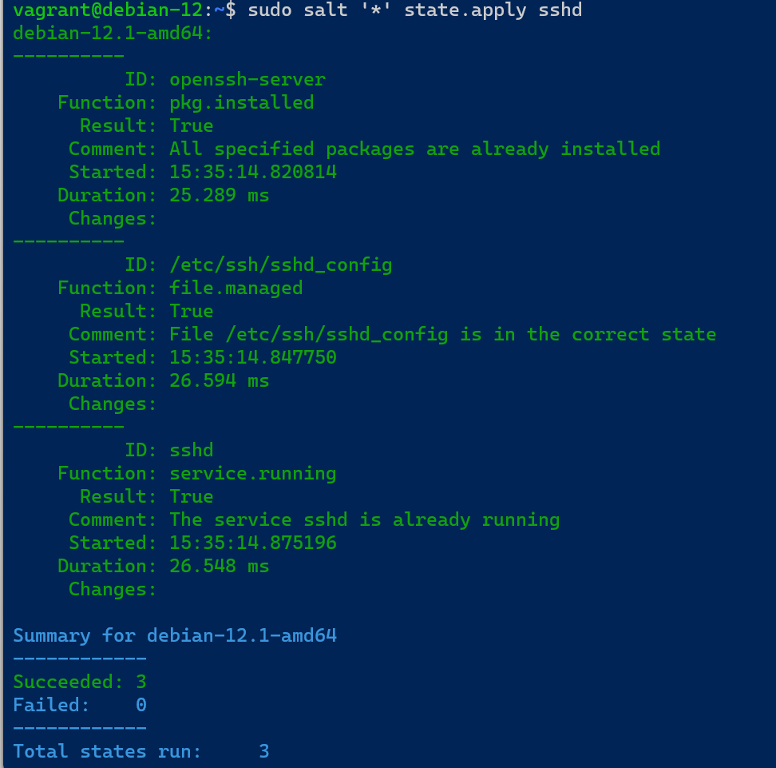
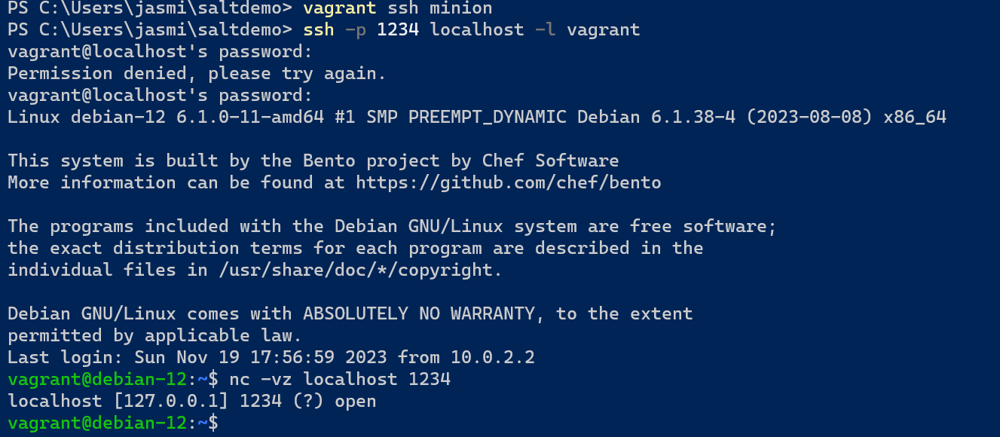

## x)
#### [Infra as Code](https://terokarvinen.com/2023/salt-vagrant/#infra-as-code---your-wishes-as-a-text-file)
Salt modulin luominen:
- Hakemiston luonti: `sudo mkdir -p /srv/salt/<esimerkki>`
- Määritystiedoston luonti: `sudoedit /srv/salt/<esimerkki>/<esimerkki>.sls`
- Määritysten ajo: `sudo salt '*' state.apply <esimerkki>`

#### top.sls
Top -tiedostolla voidaan määrittää mitkä orjat suorittaa mitäkin määrityksiä.
Top tiedoston luonti ei juurikaan poikkea edellisestä.
- Uusi tiedosto `/srv/salt/top.sls`
- Määritykset :
```yaml
base:
  '*':
    - esimerkki
```

### [Rules of YAML](https://docs.saltproject.io/salt/user-guide/en/latest/topics/overview.html#rules-of-yaml)
YAML on merkintäkieli, joka on oletusmerkintäkieli monissa Saltin käyttämissä tiedostoissa.

Perussäännöt YAMLin luomiseksi:
- Data on jaettu avain-arvo pareiksi.
-  Mappaukset käyttävät kaksoispistettä ja yhtä välilyöntiä (`": "`) merkitsemään avain-arvo pareja.
-  Avainten arvo voi olla monessa eri rakenteessa.
-  Merkkikoolla on väliä.
-  Tabulaattoreita ei sallita, vain välilyöntejä.
-  Kommentit alkavat risuaita -merkillä (`#`).

##### YAML simple structure
YAMLin rakenne koostuu kolmesta peruselementistä:

1. Skalaarit (scalars) - avain: arvo -mappauksia, joissa arvo voi olla numero, merkkijono tai looginen arvo.
2. Listat - avain, jonka arvo on lista. Jokainen arvo on omalla rivillään, aloitettuna kahdella välilyönnillä.
3. Sanakirjat - kokoelma avain: arvo -mappauksia ja listoja.

##### Lists and dictionaries - YAML block structures
YAML on järjestetty lohkorakenteisiin, ja sisennys asettaa kontekstin.

### [Salt States](https://docs.saltproject.io/salt/user-guide/en/latest/topics/states.html#state-modules)
-
### [Pkg-File-Service – Control Daemons with Salt – Change SSH Server Port](https://terokarvinen.com/2018/04/03/pkg-file-service-control-daemons-with-salt-change-ssh-server-port/)
Package-file-service on mallinnus, jota käytetään useiden demoneiden hallintaan.
- Malli koostuu kolmesta vaiheesta: "package" viittaa asennettavaan pakettiin
- file viittaa konfiguraatiotiedostoon.
- service uudelleen käynnistykseen.

## a)
Ensiksi ajoin [h2 -tehtävässä](https://github.com/J-Huttunen/palvelinten-hallinta/blob/main/h2.md#c) luomani vagrant konfiguraatiotiedoston mukaiset koneet pystyyn `vagrant up` -komennolla. 
Otin ssh yhteyden masteriin ja kävin hyväksymässä minionin avaimet. 



Tein hello world -tilan. Loin ensiksi kansion `sudo mkdir -p /srv/salt/hello_world` ja muokkasin init.sls tiedostoa `sudoedit /srv/salt/hello_world/init.sls` -komennolla seuraavanlaisesti: 
```yaml
hello_world:
  cmd.run:
    - name: echo "Hello World!"
```
`hello_world:` on tilan nimi(id).
`cmd.run` on salt moduuli.
`- name: echo "Hello World!"` on ajettava kohde.

Ajoin komennon `sudo salt '*' state.apply hello_world` ja terminaaliin tulostui ajon onnistuneen.



## b)

Muokkasin top.sls -tiedostoa `sudoedit /srv/salt/tpl.sls` -komennolla.
```yaml
base:
  '*':
    - hello_world
```

`base:` vastaa oletusympäristöä.
`'*'` Tämä on määritys, joka kertoo, että tilat suoritetaan kaikilla minion koneilla.
`- hello_world` viittaa aiemmin luomaani hello_world -tilaan.

Ajoin nyt komennon `sudo salt '*' state.apply` ja tilan ajo onnistui.



## c)
Asensin apachen minion koneelle ensiksi manuaalisesti käsin. Näin saadaan selville mitä toimenpiteitä täytyy ottaa huomioon automatisointia varten. Suoritin manuaalisen asennukset minionilla: 
`sudo apt-get install apache2`
`sudo systemctl start apache2`
`sudo systemctl enable apache2`

Lisäsin index.html tiedostoon 'Hello World' `echo "Hello World"|sudo tee /var/www/html/index.html` -komennolla

Tämän jälkeen testasin, että apache toimii ja muutokset näkyy `curl localhost` -localhost.



Sitten poistin koneet `vagrant destroy -f` , jotta voidaan täysin varmistua siitä, että manuaalisesti asennettu apache ei jää kummitelemaan minnekkään.

Ajoin `vagrant up`, otin ssh yhteyden masteriin ja tein apache.sls -tiedoston `sudoedit /srv/salt/apache.sls` ja määritin sinne seuraavat asiat: 
```yaml
install_apache:
  pkg.installed:
    - name: apache2

/var/www/html/index.html:
  file.managed:
    - source: salt://index.html

Apache_service:
  service.running:
    - name: apache2
    - enable: true
```

`install_apache`: Asentaa Apache-paketin.

`/var/www/html/index.html`: Hallinnoi `/var/www/html/index.html` -tiedostoa ja korvaa sen annetulla tiedostolla (`salt://files/index.html`).

`apache-service`: Varmistaa, että Apache-palvelin on käynnissä ja käynnistyy automaattisesti käynnistyksen yhteydessä.

Tämän jälkeen muokkasin `sudoedit /srv/salt/index.html` -tiedostoa seuraavasti:
```html
<!DOCTYPE html>
<html lang="en">
<head>
    <meta charset="UTF-8">
    <meta http-equiv="X-UA-Compatible" content="IE=edge">
    <meta name="viewport" content="width=device-width, initial-scale=1.0">
    <title>Apache</title>
</head>
<body>
    <h1>Hello World!</h1>
</body>
</html>
```

Viimeisenä ajoin komennon `sudo salt '*' state.apply apache`. Tämä komento ajoi apache.sls -tiedostossa määritellyt toimenpiteet. 



Kuvasta näkyy, että kaikki kohdat onnistui. Muutoksia oli vain kaksi, koska asennusvaiheessa apache käynnistyy automaattisesti, joten viimeisessä `service.running` -kohdassa ei tullut muutoksia. 

Otin lopuksi ssh yhteyden minion koneelle ja testasin, että apache on varmasti käynnissä ja oletussivu on muutettu.




## d)

Jatkoin tehtävien suorittamista vagrant koneilla.
Tein master -koneella `/srv/salt/sshd.sls` -tiedoston, johon määritin seuraavat asiat: 
```yaml
openssh-server:
  pkg.installed
  
/etc/ssh/sshd_config:
  file.managed:
    - source: salt://sshd_config
    
sshd:
  service.running:
    - watch:
      - file: /etc/ssh/sshd_config
```
`openssh-server` kohta asentaa openssh-server -paketin.

`/etc/ssh/sshd_config:` osio käyttää file.managed -moduulia ja hallinnoi `sshd_config` -tiedostoa. Salt hakee tiedoston lähdepolusta (`salt://sshd_config`) ja vertaa sitä minionin vastaavaan tiedostoon. Jos tiedosto eroaa, SaltStack päivittää sen lähteen mukaiseksi.

`sshd` kohta käyttää `service.running` -moduulia, joka avrmistaa. että ssh on käynnissä.

Seuraavaski määritin `sshd_config` -tiedostoon portti numeron:
 ```yaml
Port 1234
```
Tässä vaiheessa ajoin muutoksen minionille `sudo salt '*' state.apply sshd`.



Kävin muokkaamassa vagrantin konfiguraatio tiedostoa, koska lisäsin portinohjauksen minionin uuteen ssh porttiin. Jälkikäteen tajusin, että tämä vaihe ollut välttämätön, vaan homman olisi saanut toimimaan ilmankin. 

```ruby
Vagrant.configure("2") do |config|
  config.vm.define :master do |master|
    master.vm.box = "bento/debian-12"
    master.vm.network "private_network", ip: "192.168.56.11"
    master.vm.provision "shell", inline: <<-SHELL
      echo "Master provisioning script"
      sudo mkdir /etc/apt/keyrings
      sudo curl -fsSL -o /etc/apt/keyrings/salt-archive-keyring-2023.gpg https://repo.saltproject.io/salt/py3/debian/11/amd64/SALT-PROJECT-GPG-PUBKEY-2023.gpg
      echo "deb [signed-by=/etc/apt/keyrings/salt-archive-keyring-2023.gpg arch=amd64] https://repo.saltproject.io/salt/py3/debian/11/amd64/latest bullseye main" | sudo tee /etc/apt/sources.list.d/salt.list
      sudo apt-get update -y
      sudo apt-get install salt-master -y
    SHELL
  end

  config.vm.define :minion do |minion|
    minion.vm.box = "bento/debian-12"
    minion.vm.network "private_network", ip: "192.168.56.12"
    minion.vm.network "forwarded_port", guest: 1234, host:1234
    minion.vm.provision "shell", inline: <<-SHELL
      echo "Minion provisioning script"
      sudo mkdir /etc/apt/keyrings
      sudo curl -fsSL -o /etc/apt/keyrings/salt-archive-keyring-2023.gpg https://repo.saltproject.io/salt/py3/debian/11/amd64/SALT-PROJECT-GPG-PUBKEY-2023.gpg
      echo "deb [signed-by=/etc/apt/keyrings/salt-archive-keyring-2023.gpg arch=amd64] https://repo.saltproject.io/salt/py3/debian/11/amd64/latest bullseye main" | sudo tee /etc/apt/sources.list.d/salt.list
      sudo apt-get update -y
      sudo apt-get install salt-minion -y
      echo "master: 192.168.56.11" > /etc/salt/minion
      sudo service salt-minion restart
    SHELL
  end

    config.vm.provider "virtualbox" do |vb|
     vb.memory = "1024"
     vb.cpus = 2
   end
end
```

Testasin toimiko määritykset oman koneeni powershellissa komennolla: `ssh -p 1234 localhost -l vagrant`



Sain yhteyden minioniin, josta päättelin, että määrityksen toimivat.

## Lähteet
Karvinen, T. 2023. Infra as Code. Luettavissa: https://terokarvinen.com/2023/salt-vagrant/#infra-as-code---your-wishes-as-a-text-file

Salt Project. 2023. Rulew of Yaml Luettavissa: https://docs.saltproject.io/salt/user-guide/en/latest/topics/overview.html#rules-of-yaml

Karvinen, T. 2018. Pkg-File-Service – Control Daemons with Salt – Change SSH Server Port. Luettavissa: https://terokarvinen.com/2018/04/03/pkg-file-service-control-daemons-with-salt-change-ssh-server-port/?fromSearch=karvinen%20salt%20ssh

Salt Project. 2023. Salt Modules. Luettavissa: https://docs.saltproject.io/salt/user-guide/en/latest/topics/states.html#state-modules

Hashicorp. Forwarded Ports. Luettavissa: https://developer.hashicorp.com/vagrant/docs/networking/forwarded_ports
