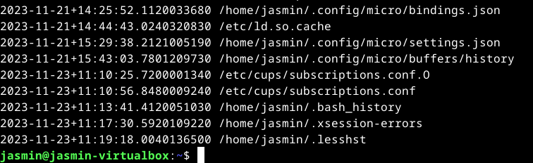
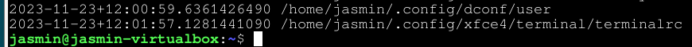
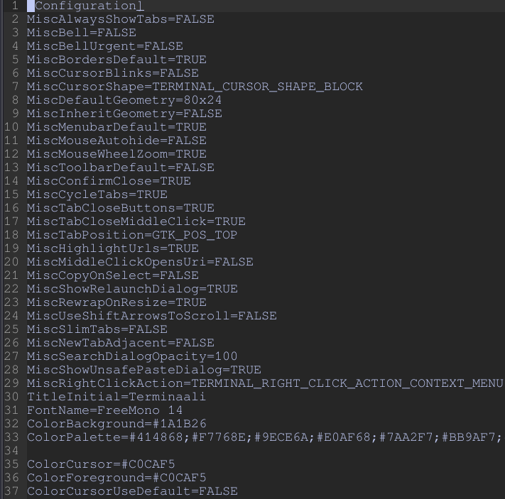
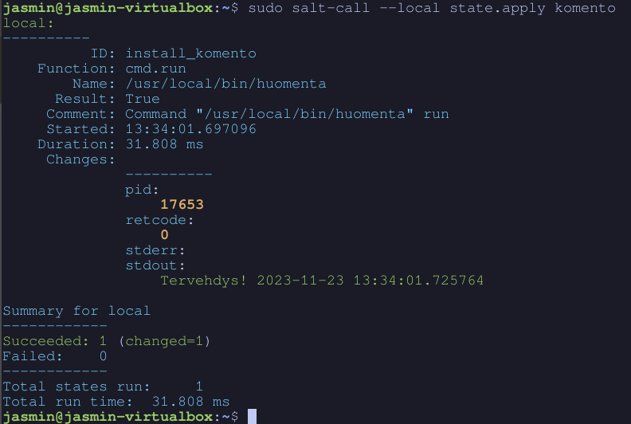
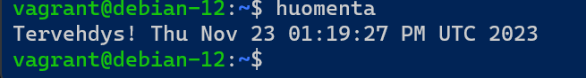
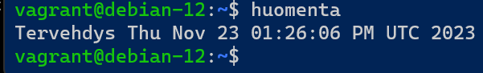
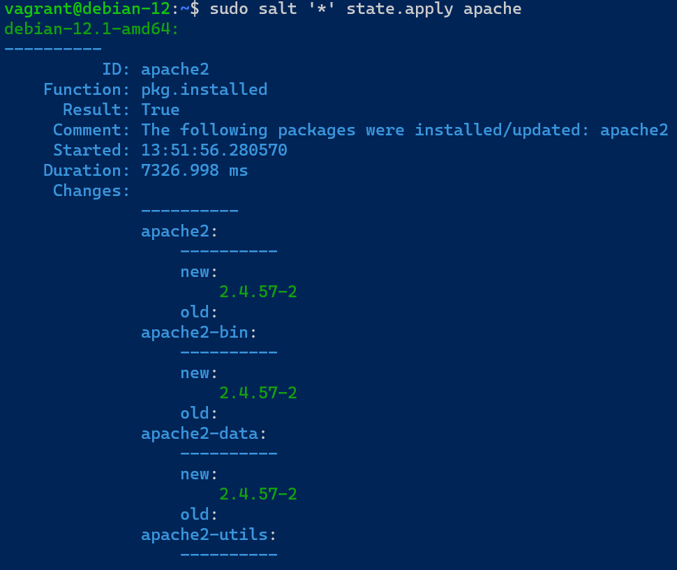
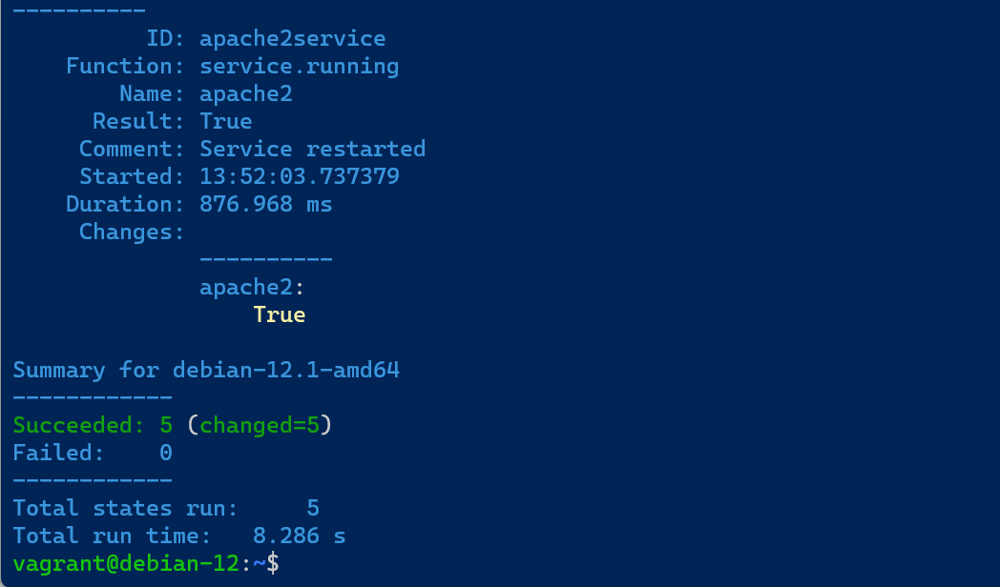
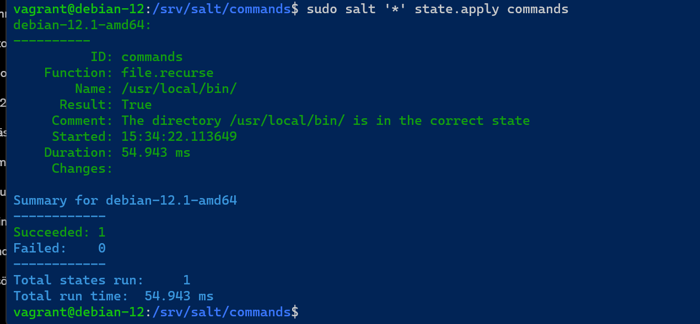
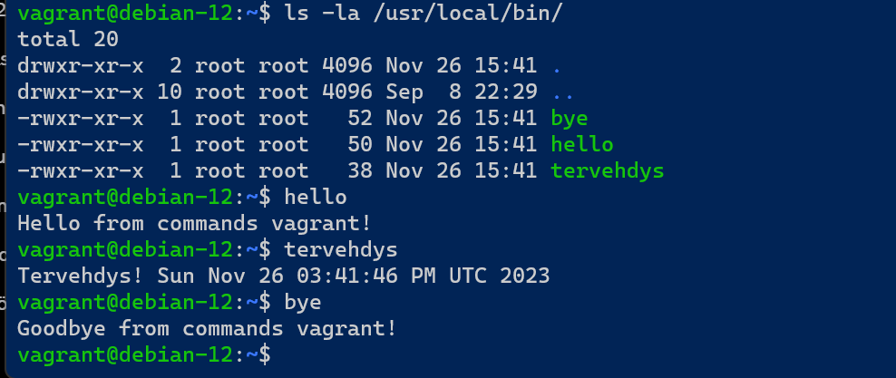

## x) Apache User Homepages Automatically – Salt Package-File-Service Example
- Aluksi asenna manuaalisesti; automaatio on mahdollista vasta, kun osaat tehdä asiat manuaalisesti.
- `find -printf "%T+ %p\n"|sort` -komennolla näkee viimeksi muokatut tiedostot.
- Tee tilasta idempotentti. 
(Karvinen 2018)

## a)
Lähdin find -komennon avulla katsomaan viimeisimmät muokatut tiedostot /etc/ -ja koti hakemistosta.
Ajoin komennon `find /etc/ /home/jasmin -type f -printf '%T+ %p\n' | sort`.
`find` etsii tiedostoja hakemistosta.

`/etc/ /home/jasmin` Hakemistot, joista haetaan tietoja.

`-type f` Rajaa haun tiedostoihin.

`-printf '%T+ %p\n'` Määrittelee, miten tiedostojen tiedot tulostetaan.

- `%T+` Tulostaa tiedoston muokkausajan tietyssä aikaleiman formaatissa.
- 
- `%p` Tulostaa tiedoston polun.
- 
- `\n` Lisää rivinvaihdon jokaisen tiedoston tiedon jälkeen.
- 
 `| sort` Putki ohjaa edellisen komennon seuraavalle, eli sortille, joka lajittelee numerot nousevassa järjestyksessä



## b)
Päätin mukauttaa Xfce terminaalin ulkoasua tekemällä muutoksia otsikkoon, fonttiin ja väriasetuksiin.

Etsin asetustiedoston aiemmin käyttämälläni komennolla `find /home/jasmin -type f -printf '%T+ %p\n' | sort`



Asetustiedotossa näkyi tekemäni muutokset, eli terminaalin otsikko (title), fontti, ja väri asetukset.



## c)
Tein saltilla tilan, joka asentaa järjestelmään komennon, joka ajettaessa tulostaa terminaaliin "tervehdys" ja päivämäärän, sekä kellonajan. Komennolla `sudo mkdir /srv/salt/komento/` tein kansion johon lisäsin init.sls -tiedston, jonne määritin seuraavat asetukset:

```yaml
install_komento:
  cmd.run:
    - name: /usr/local/bin/huomenta
```

Komennolla `sudo salt-call --local state.apply komento` ajoin uuden komennon paikallisesti yhdelle virtuaalikoneella.



Siirryin tässä vaiheessa vagrant -koneille suorittamaan tämän tehtävän. (Master ja minion)

Tein uuden "komennon" `/usr/local/bin/huomenta` -tiedostoon.
```bash
#!/bin/bash
echo "Tervehdys! $(date)"
```
Lisäsin tiedostolle execute oikeudet `sudo chmod +x /usr/local/bin/huomenta ` -komennolla ja testasin ajaa sitä ensin pelkästään master koneella.



Lähdin automatisoimaan skriptiä luomalla ensin kansion `sudo mkdir /srv/salt/komento/` -komennolla. Kansioon tein `init.sls` -tiedoston, johon määriin seuraavat asiat: 
```yaml
komento:
  file.managed:
    - name: /usr/local/bin/huomenta
    - source: salt://huomenta
    - mode: 755
```
`komento` on tilan nimi.

`file.managed` on tiedostonhallintatila.

`name: /usr/local/bin/huomenta`: Määrittää tiedoston polun ja nimen, johon tämä tila vaikuttaa.

`source: salt://huomenta`: Määrittää lähteen, josta tiedosto kopioidaan.

`mode: 755`: Määrittää tiedoston oikeudet (chmod) numeroina. `755` antaa luku- ja suoritusoikeudet omistajalle, ja luku- ja suoritusoikeudet ryhmälle

Ajoin komennon `sudo salt '*' state.apply komento` ja Otin SSH-yhteyden minion-koneelle ja ajoin komennon `komento`. Tuloksena terminaalissa näkyi "tervehdys" ja nykyinen päivämäärä.



## d)
Tässä vaiheessa kävin tuhoamassa koneet `vagrant destroy -f` -komennolla, koska koneet jostai syystä toimi todella hitaasti. Kävin jälleen hyväksymässä minionin avaimet `sudo salt-key -A`

Lähdin tekemään salt-tilaa joka asentaa apachen näyttämään kotihakemistoja.
 
Loin hakemiston `sudo mkdir -p /srv/salt/apache`, jonne tein init.sls -tiedoston, johon määritin:
```yaml
apache2:
  pkg.installed
/var/www/html/index.html:
  file.managed:
    - source: salt://apache/default-index.html
/etc/apache2/mods-enabled/userdir.conf:
  file.symlink:
    - target: ../mods-available/userdir.conf
/etc/apache2/mods-enabled/userdir.load:
  file.symlink:
    - target: ../mods-available/userdir.load
apache2service:
  service.running:
    - name: apache2
    - watch:
      - file: /etc/apache2/mods-enabled/userdir.conf
      - file: /etc/apache2/mods-enabled/userdir.load
```

Ajoin komennon `sudo salt '*' state.apply apache`, joka tulosti kaikkien ajon onnistuneen. 





Katsoin [teron ohjetta](https://terokarvinen.com/2018/04/03/apache-user-homepages-automatically-salt-package-file-service-example/) , jossa mainittiin käyttäjän tekevän itse omat sivunsa. Tein siis minion -koneella kansion `mkdir public_html` -komennolla ja `echo "Hei apache" |tee public_html/index.html` -komennolla siihen index.html sivun.
Testasin `curl http://localhost/~vagrant/`, joka palautti halutun "hei apache".


## e)

Lähdin tekemään salt-tilaa, joka asentaa järjestelmään usean komennon.
Tein ensiksi tein `/srv/salt/commands/scripts` -kansioon kolme tiedostoa:
- tervehdys
```bash
#!/bin/bash
echo "Tervehdys! $(date)"
```
- hello
```bash
#!/bin/bash
echo "Hello from commands $(whoami)!"
```
- bye
```bash
#!/bin/bash
echo "Goodbye from commands $(whoami)!"
```

Seuraavaksi tein `/srv/salt/commands` -kansioon `init.sls` -tiedoston. Tähän luin [saltin dokumentaatiosta](https://docs.saltproject.io/en/latest/ref/states/all/salt.states.file.html#salt.states.file.recurse), mikä file state olisi oikea. 
```yaml
commands:
  file.recurse:
    - name: /usr/local/bin/
    - source: salt://commands/scripts
    - dir_mode: 755
    - file_mode: 755
```

`file.recurse`: salt-moduuli, joka suorittaa operaatioita rekursiivisesti.

`name`: hakemisto, johon tiedostot kopiodaan.

`source`: hakemisto, josta tiedostot haetaan.

`dir_mode`: Hakemiston oikeudet 755, mikä tarkoittaa, että omistajalla on luku, kirjoitus ja suoritusoikeudet, ja muilla käyttäjillä on vain luku- ja suoritusoikeudet.

`file_mode`: Tiedoston oikeudet.

Ajoin `sudo salt '*' state.apply commands` 



Otin ssh yhteyden minioniin ja`ls -la /usr/local/bin/commands` -komennolla tarkistin, että tiedostoilla oli oikeat oikeudet ja että komennot olivat varmasti minionilla.
Sain ajettua kaikki komennot, josta pystyin päätellä tilan toimivan.



## Lähteet

`man find` 

Karvinen, T. 2018. Apache User Homepages Automatically – Salt Package-File-Service Example. Luettavissa: https://terokarvinen.com/2018/04/03/apache-user-homepages-automatically-salt-package-file-service-example/

VMware, Inc. 2023. file.recurse. Luettavissa: https://docs.saltproject.io/en/latest/ref/states/all/salt.states.file.html#salt.states.file.recurse
