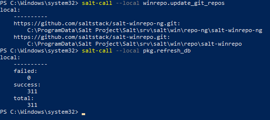
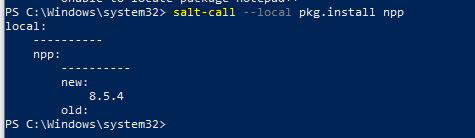
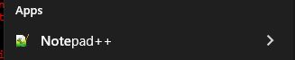
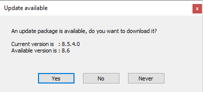

## x)

[**Installing Windows 10 on a virtual machine.**](https://github.com/therealhalonen/PhishSticks/blob/master/notes/ollikainen/windows.md)
- Lataustiedosto virallisilta microsoftin sivuilta.
- Kovalevytilaa virtuaalikoneelle 50gt
- Suositellaan 8gt RAM -muistia.
- Suositellaan vähintään 4 prosessoria.

[**Filesystem Hierarchy Standard**](https://refspecs.linuxfoundation.org/FHS_3.0/fhs/index.html)
- /etc 
	- Konfiguraatiotiedostot ja asetukset koko järjestelmälle
- /srv
	- Sisältää palvelukohtaisia tiedostoja
- /home
	- Käyttäjien kotikansiot.
- /usr
	- Kaikille jaettavaa, read-only
- /tmp
	- Väliaikaiset tiedostot.

## a) windowsin asennus virtuaalikoneelle
Latasin windows 10 virtuaalikoneelle [tältä sivustolta](https://www.microsoft.com/en-us/evalcenter/download-windows-10-enterprise).

Asennuksen kerkesin tehdä tunnilla, hyödyntäen [ohjetta](https://github.com/therealhalonen/PhishSticks/blob/master/notes/ollikainen/windows.md).

Asetin virtuaalikoneelle seuraavat tekniset tiedot:
- Ydinten määrä: 5
- RAM: 8 GB
- Kovalevytila: 50 GB

Koneen kieleksi asetin Englanti, alueeksi Suomi ja näppäimistön layoutiksi suomalainen.

## b) Salt windowsille
Latasin Saltin asennustiedoston [Saltin viralliselta sivustolta](https://repo.saltproject.io/windows/).
Käytin asennukseen tiedostoa nimeltään `Salt-Minion-3004.2-1-Py3-AMD64-Setup.exe`.
Suoritin asennusohjelman, ja säilytin kaikki asetukset oletusarvoina.

Ajoin komennon powershellissä `salt-call --local --version`, joka palautti saltin version. 

## c) grains.item
Hain komennolla `salt-call --loocal grains.item osfinger cpu_model timezone` tietoa koneesta.

Komento palautti: 
prosessorin mallin, joka tulee isäntä koneelta. 
osfinger palautti käyttöjärjestelmän ja version.
timezone palautti aikavyöhykkeen.

## d) Salt file funktio

Suoritin komennon `salt-call –-local state.single file.managed c:\users\Jeejee\documents\test.txt`. Tämä komento loi uuden tekstitiedoston `test.txt` documents -kansioon.

Tilan ajo onnistui. 
Kävin vielä tarkistamassa documents -kansiosta, että tiedosto oli siellä:

## e) Uusi toiminto saltista windowsilla
Testasin itselleni uutta salt toimintoa windowsilla. 
Päivitin aiempaa tekstitiedostoa `salt-call –-local state.single file.append c:\users\Jeejee\documents\test.txt text='textext'`
Käytetty komento `file.append` kertoo Salt-konfiguraatiohallintatyökalulle, että haluan lisätä tekstiä tiedostoon.
Tiedostopolku `c:\users\Jeejee\documents\test.txt` määrittelee kohteena olevan tiedoston.

Käytetty komento onnistui päivittämään `test.txt` -tiedostoa lisäämällä siihen uutta tekstiä (`textext`).

## f) package -funktio windowsilla

Löysin salt project sivuilta [ohjeen](https://docs.saltproject.io/en/latest/topics/windows/windows-package-manager.html) package -funktion käyttöön windowsilla. 

Asensin ensin [Gitin](https://git-scm.com/download/win), mikä on välttämätöntä [salt-winrepo-ng](https://github.com/saltstack/salt-winrepo-ng)-repositorion käyttöön. Tämä repositorio mahdollistaa samankaltaisen paketinhallinnan Windowsille kuin Linux-ympäristössä.

Ajoin komennot: `salt-call --local winrepo.update_git_repos`, joka päivittää `salt-winrepo-ng` -repositorion. 
Tämä varmistaa, että saltilla on käytössä viimeisin saatavilla oleva tieto windows ohjelmisoista. 
Seuraavaksi ajoin komennon `salt-call --local pkg.refresh_db` päivittääkseni paikallisen pakettitietokannan. Tämä toimii samaan tapaan, kuin esim. debian koneessa `apt update`. 

Asensin notepad++ -sovelluksen komennolla `salt-call --local pkg.install npp`. Päättelin oikean komennon tutkimalla salt-winrepoa.

Komento tosin ei ladannut viimeisintä versiota sovelluksesta, joten sovellusta käynnistäessä, tarjosi se samantien uusinta päivitystä.
Kokeilin vielä ajaa `salt-call --local pkg.upgrade npp` -komennon, mutta sekään ei löytänyt uusinta versiota.

## Lähteet
Halonen, Rajala ja Ollikainen. 2023. Installing Windows 10 on a virtual machine. Luettavissa: https://github.com/therealhalonen/PhishSticks/blob/master/notes/ollikainen/windows.md.

LSB Workgroup. 2015. Filesystem Hierarchy Standard. Luettavissa: https://refspecs.linuxfoundation.org/FHS_3.0/fhs/index.html

VMware inc. 2023. Windows package manager. Luettavissa: https://docs.saltproject.io/en/latest/topics/windows/windows-package-manager.html.

