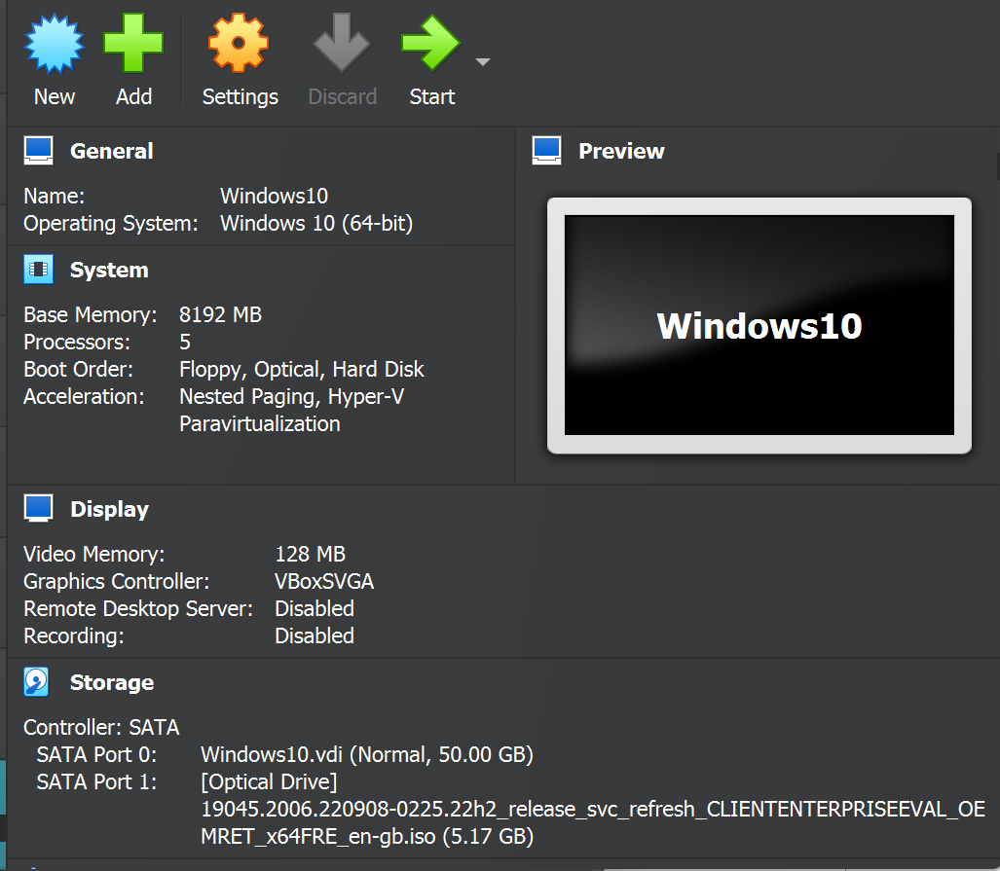
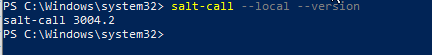
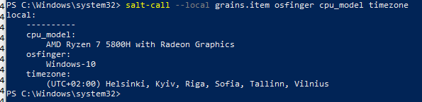
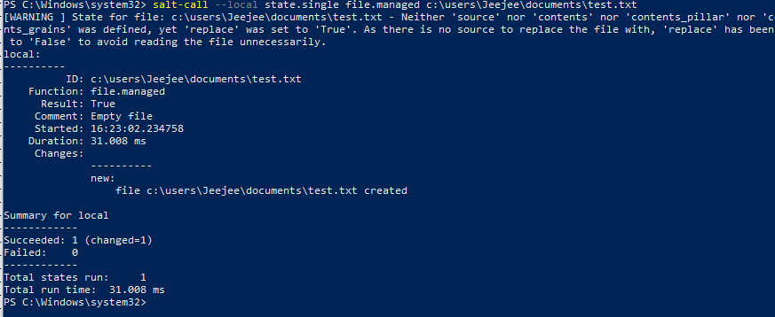
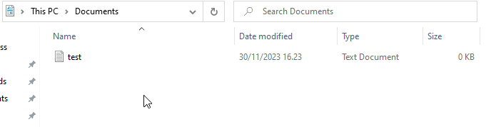
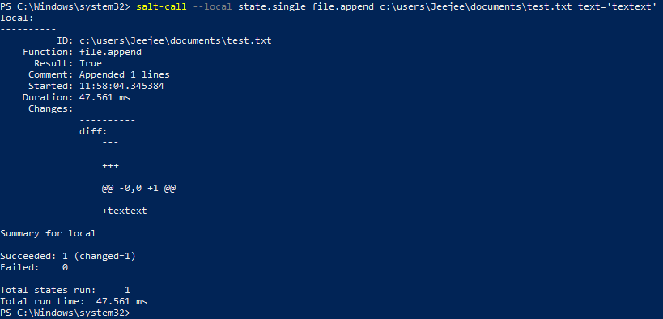
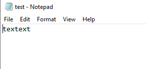

## a)
Latasin windows 10 virtuaalikoneelle [tältä sivustolta](https://www.microsoft.com/en-us/evalcenter/download-windows-10-enterprise).

Asennuksen kerkesin tehdä tunnilla, hyödyntäen [ohjetta](https://github.com/therealhalonen/PhishSticks/blob/master/notes/ollikainen/windows.md).

Asetin virtuaalikoneelle seuraavat tekniset tiedot:
- Ydinten määrä: 5
- RAM: 8 GB
- Kovalevytila: 50 GB

Koneen kieleksi asetin Englanti, alueeksi Suomi ja näppäimistön layoutiksi suomalainen.

## b)
Latasin Saltin asennustiedoston [Saltin viralliselta sivustolta](https://repo.saltproject.io/windows/).
Käytin asennukseen tiedostoa nimeltään `Salt-Minion-3004.2-1-Py3-AMD64-Setup.exe`.
Suoritin asennusohjelman, ja säilytin kaikki asetukset oletusarvoina.

Ajoin komennon powershellissä `salt-call --local --version`, joka palautti saltin version. 

## c)
Hain komennolla `salt-call --loocal grains.item osfinger cpu_model timezone` tietoa koneesta.

Komento palautti: 
prosessorin mallin, joka tulee isäntä koneelta. 
osfinger palautti käyttöjärjestelmän ja version.
timezone palautti aikavyöhykkeen.

## d)

Suoritin komennon `salt-call –-local state.single file.managed c:\users\Jeejee\documents\test.txt`. Tämä komento loi uuden tekstitiedoston `test.txt` documents -kansioon.

Tilan ajo onnistui. 
Kävin vielä tarkistamassa documents -kansiosta, että tiedosto oli siellä:

## e)
Testasin itselleni uutta salt toimintoa windowsilla. 
Päivitin aiempaa tekstitiedostoa `salt-call –-local state.single file.append c:\users\Jeejee\documents\test.txt text='textext'`
Käytetty komento `file.append` kertoo Salt-konfiguraatiohallintatyökalulle, että haluan lisätä tekstiä tiedostoon.
Tiedostopolku `c:\users\Jeejee\documents\test.txt` määrittelee kohteena olevan tiedoston.

Käytetty komento onnistui päivittämään `test.txt` -tiedostoa lisäämällä siihen uutta tekstiä (`textext`).

## Lähteet
Installing Windows 10 on a virtual machine. Luettavissa: https://github.com/therealhalonen/PhishSticks/blob/master/notes/ollikainen/windows.md.

