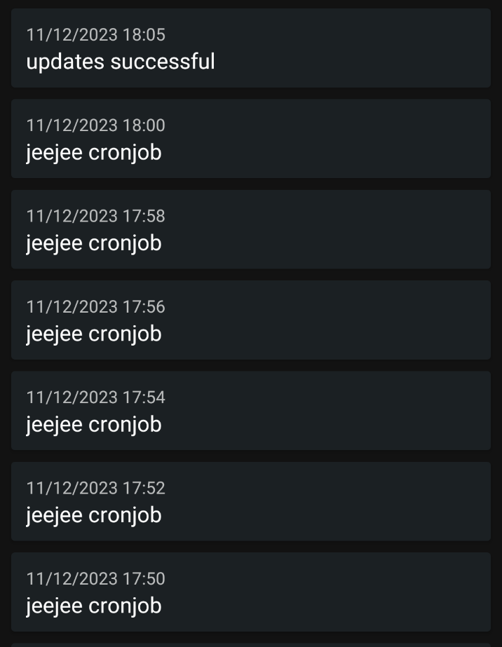

Tarkoituksena oli automatisoida ntfy -palvelimen asennus käyttäen saltia. 
NTFY on yksinkertainen HTTP-pohjainen pub-sub (publish-subscribe) -ilmoituspalvelu.

## Asennus saltilla

Vuokrasin linodelta palvelimen ja tein api avaimen. Api avaimelle annoin kaikki oikeudet, koska en löytänyt sopivaa komboa, jolla saisin tämän muuten toimimaan. 


Otin ssh yhteyden linode palvelin koneelle. Asensin siihen salt-masterin ja salt-cloudin.

Tein `/etc/salt/cloud.providers` -hakemistoon `linode.conf` -tiedoston.
```
linode:
  provider: linode
  password: <linode_password
  apikey: <linode_api_key>
  api_version: v4
  driver: linode
```
`linode:`: Alustaa Linode-palveluntarjoajan konfiguraation.
`provider: linode`: Määrittelee palveluntarjoajan tyyppinä Linoden.
`password: <linode_password>`: Linode-tilin root salasana.
`apikey: <linode_api_key>`: Linode-tiliin liitetty API-avain.
`api_version: v4`: Määrittää Linoden API:n version 4.
`driver: linode`: Määrittelee Linoden Cloud-palvelimen käyttöön otettavan driverin (ajurin).

Seuraavaksi tein `/etc/salt/cloud.profiles` -hakemistoon `minion.conf` -tiedoston.

```
minion:
  provider: linode-provider
  size: g6-nanode-1
  image: linode/debian11
  location: se-sto
  minion:
    master: <master_ip> 
```

`minion:`: Määrittelee profiilin nimen, tässä tapauksessa "minion".
`provider: linode-provider`: Kertoo, että tämä profiili käyttää Linode-palveluntarjoajaa Salt Cloudissa.
`size: g6-nanode-1`: Määrittelee palvelimen kokoluokan, tässä käytetään "g6-nanode-1", eli pienintä mahdollista.
`image: linode/debian11`: Valitsee palvelimelle käytettävän kuvan, tässä Debian 11 Linode-kuvan.
`location: se-sto`: Määrittelee palvelimen sijainnin, tässä käytetään "se-sto".
`minion: master: <master_ip>`: Määrittää minionille masterin IP-osoitteen, johon se liittyy. 

Ajoin komennon `curl -fsSL https://archive.heckel.io/apt/pubkey.txt | sudo gpg --dearmor -o /srv/salt/ntfy/archive.heckel.io.gpg`,  
tämä komento lataa GPG-avaimen tiedoston verkosta, muuntaa sen binäärimuotoon ja tallentaa sen `/srv/salt/ntfy/archive.heckel.io.gpg` -tiedostoon.

`/srv/salt/ntfy` tein vielä tiedoston `archive.heckel.io.list` johon laitoin `deb [arch=amd64 signed-by=/etc/apt/keyrings/archive.heckel.io.gpg] https://archive.heckel.io/apt debian main`

Tein `/srv/salt/ntfy` -hakemistoon `init.sls` -tiedoston, joka asentaa tulevalle minion -koneelle ntfy -palvelimen.
```yaml
 /etc/apt/keyrings:
  file.directory:
    - makedirs: True

apt-transport-https:
  pkg.installed

/etc/apt/keyrings/archive.heckel.io.gpg:
  file.managed:
    - source: salt://archive.heckel.io.gpg

/etc/apt/sources.list.d/archive.heckel.io.list:
  file.managed:
    - source: salt://archive.heckel.io.list

install_ntfy:
  pkg.installed:
    - refresh: True
    - name: ntfy
```
 `/etc/apt/keyrings:`: Tarkistaa, että `/etc/apt/keyrings` -hakemisto on olemassa.
 
`file.directory:`: Salt State -moduuli, joka varmistaa hakemiston olemassaolon.

`apt-transport-https:`: Asentaa `apt-transport-https` -paketin.

`pkg.installed:`: Salt State -moduuli, joka varmistaa paketin asennuksen.
`/etc/apt/keyrings/archive.heckel.io.gpg:`: Tarkistaa, että `/etc/apt/keyrings/archive.heckel.io.gpg` -tiedosto on olemassa.

 `file.managed:`: Salt State -moduuli, joka varmistaa tiedoston olemassaolon ja hallinnan.

`/etc/apt/sources.list.d/archive.heckel.io.list:`: Tarkistaa, että `/etc/apt/sources.list.d/archive.heckel.io.list` -tiedosto on olemassa.

`install_ntfy:`: tilan id.
`pkg.installed:`: Salt State -moduuli, joka varmistaa paketin asennuksen.
`refresh: True`: Paketin asennuksen yhteydessä päivittää pakettilistat.
`name: ntfy`: Määrittelee asennettavan paketin nimen.

Tein `/srv/cloud` -hakemiston johon tein `ntfy` -tiedoston. 
```yaml
minion:
  - ntfy-1:
      location: se-sto
```
`minion:`: Määrittelee profiilin nimen, tässä tapauksessa "minion".
 `- ntfy-1:`: Määrittelee minionin nimen, tässä "ntfy-1". 
`location: se-sto`: Määrittää minionin sijainnin, tässä "se-sto" eli Tukholma, Ruotsi.

Tämä profiilitiedosto antaa Salt Cloudille ohjeet siitä, miten se luo ja asentaa minionin (Salt-asiakas) Linode-palvelimelle. Tässä määritellään yksi minion, nimeltään "ntfy-1", ja määritellään sen sijainti "se-sto" (Tukholma, Ruotsi). Tämä profiilitiedosto käytetään sitten `sudo salt-cloud -m /srv/cloud/ntfy` -komentoa suoritettaessa.

Komennolla `sudo salt-cloud  -m /srv/cloud/ntfy` sain automaattisesti vuokrattua minion koneen.

Master -koneella näkyi automaattisesti minionin avain hyväksyttynä.


Komennolla: `sudo salt 'ntfy*' state.apply ntfy` ajoin ntfy -palvelimen asennuksen vuokratulle minion -koneelle.

```bash
vagrant@debian-12:/srv/salt/ntfy$ sudo salt '*' state.apply ntfy
debian-12.1-amd64:
----------
          ID: /etc/apt/keyrings
    Function: file.directory
      Result: True
     Comment: The directory /etc/apt/keyrings is in the correct state
     Started: 11:02:26.223306
    Duration: 5.138 ms
     Changes:
----------
          ID: apt-transport-https
    Function: pkg.installed
      Result: True
     Comment: The following packages were installed/updated: apt-transport-https
     Started: 11:02:27.086232
    Duration: 2414.861 ms
     Changes:
              ----------
              apt-transport-https:
                  ----------
                  new:
                      2.6.1
                  old:
----------
          ID: /etc/apt/keyrings/archive.heckel.io.gpg
    Function: file.managed
      Result: True
     Comment: File /etc/apt/keyrings/archive.heckel.io.gpg updated
     Started: 11:02:29.503491
    Duration: 40.033 ms
     Changes:
              ----------
              diff:
                  New file
              mode:
                  0644
----------
          ID: /etc/apt/sources.list.d/archive.heckel.io.list
    Function: file.managed
      Result: True
     Comment: File /etc/apt/sources.list.d/archive.heckel.io.list updated
     Started: 11:02:29.543678
    Duration: 36.551 ms
     Changes:
              ----------
              diff:
                  New file
              mode:
                  0644
----------
          ID: install_ntfy
    Function: pkg.installed
        Name: ntfy
      Result: True
     Comment: The following packages were installed/updated: ntfy
     Started: 11:02:29.585215
    Duration: 6848.206 ms
     Changes:
              ----------
              ntfy:
                  ----------
                  new:
                      2.8.0
                  old:

Summary for debian-12.1-amd64
------------
Succeeded: 5 (changed=4)
Failed:    0
------------
Total states run:     5
Total run time:   9.345 s
```

## NTFY testaus cronjobilla

Kävin tekemässä ntfy:n sovelluksella palvelimen osoitteeseen ilmoitusten tilauksen. Testasin ajaa `curl -d "successful" http://172.234.120.86/ntfyTopic`,  joka lähetti puhelimeeni ilmoituksen. 


Tein ensin testimielessä virtuaalikoneella cronjobiin määrityksen, joka lähettää ilmoituksia joka 2. minuutti. Komennolla `crontab -e` avasin cronjobin asetustiedoston. Sinne laitoin 
```
*/2 * * * * curl -d "jeejee cronjob" http://172.234.120.86/ntfyTopic
```

Kävin vaihtamassa tämän, että cronjob päivittää virtuaalikoneen jokaisen tunnin viides minuutti ja lähettää curlilla ntfy -palvelimelle "updates successful", jos päivityksen onnistuvat:
`crontab -e`
```
5 * * * *  sudo apt update -y && sudo apt upgrade -y && curl -d "updates successful" http://172.234.120.86/ntfyTopic
```



## Palomuuri saltilla

Lisäsin vielä saltilla palomuuriasetukset `/srv/salt/ntfy` -kansiossa sijaitsevaan `init.sls` tiedostoon. 
```yaml
/etc/apt/keyrings:
  file.directory:
    - makedirs: True

apt-transport-https:
  pkg.installed

/etc/apt/keyrings/archive.heckel.io.gpg:
  file.managed:
    - source: salt://ntfy/archive.heckel.io.gpg

/etc/apt/sources.list.d/archive.heckel.io.list:
  file.managed:
    - source: salt://ntfy/archive.heckel.io.list

install_ntfy:
  pkg.installed:
    - refresh: True
    - name: ntfy

ntfyService:
  service.running:
    - name: ntfy

ufw:
  pkg.installed:
    - pkgs:
      - ufw

ufw allow 22/tcp:
  cmd.run:
    - unless: "ufw status verbose | grep '22/tcp'"
ufw allow 80/tcp:
  cmd.run:
    - unless: "ufw status verbose | grep '80/tcp'"

ufw enable:
  cmd.run:
    - unless: "ufw status | grep 'Status: active'"
```

`ufw:`: Tämä määrittelee Salt State -moduulin, joka hallitsee `ufw`-paketin asennusta.

`pkg.installed:`: Salt State -moduuli, joka varmistaa, että `ufw` on asennettu.
`pkgs:`: Määrittelee paketit, jotka tulee asentaa. Tässä tapauksessa vain `ufw`.

`ufw allow 22/tcp:`: Tämä osa määrittelee Salt State -moduulin, joka ajaa komennon (`cmd.run`), joka sallii liikenteen portissa 22 (SSH-portti) palomuurissa, jos se ei ole jo sallittu.

`unless: "ufw status verbose | grep '22/tcp'"`: Määrittelee ehtolauseen, joka tarkistaa, onko portti 22 sallittu. Jos se ei ole sallittu, komento suoritetaan.

`ufw allow 80/tcp:`: Tämä osa määrittelee Salt State -moduulin, joka sallii liikenteen portissa 80 (HTTP-portti) palomuurissa, jos se ei ole jo sallittu.

`unless: "ufw status verbose | grep '80/tcp'"`: Määrittelee ehtolauseen, joka tarkistaa, onko portti 80 sallittu. Jos se ei ole sallittu, komento suoritetaan.

`ufw enable:`: Tämä osa määrittelee Salt State -moduulin, joka ajaa komennon (`cmd.run`), joka ottaa palomuurin käyttöön, jos se ei ole jo käytössä.

`unless: "ufw status | grep 'Status: active'"`: Määrittelee ehtolauseen, joka tarkistaa, onko palomuuri jo aktiivinen. Jos se ei ole aktiivinen, komento suoritetaan.

Ajoin `sudo salt 'ntfy*' state.apply ntfy`, joka palautti palomuuriasetusten onnistuneen.


## Lähteet

https://zesc.wiki/articles/basics/secure-debian-salt/


https://help.dreamhost.com/hc/en-us/articles/215767047-Creating-a-custom-Cron-Job

https://docs.saltproject.io/en/latest/topics/cloud/qs.html#salt-cloud-qs

https://docs.saltproject.io/en/latest/topics/cloud/linode.html

https://docs.ntfy.sh/install/

https://docs.ntfy.sh/config/
